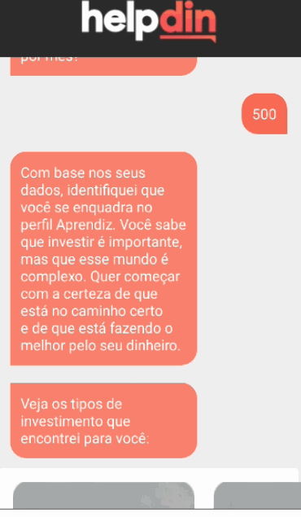

<div align="center">
  
  
</div>

## :computer: Projeto

helpDin - Para ajudar pessoas sem conhecimento sobre finanças a realizarem seus objetivos e metas, apresentamos helpdin. Um assistente digital que conversa com o usuário para ajudar no investimento financeiro e enviar dicas de economia.

## :pushpin: Tecnologias

Esse projeto foi desenvolvido com as seguintes tecnologias:

- [React Native](https://reactnative.dev/)
- [TypeScript](https://www.typescriptlang.org/)
- [Styled Components](https://styled-components.com/)
- [Expo](https://expo.io/)


## :point_down: Executando o projeto

No seu terminal copie e cole ou digite o comando abaixo:

```git
git clone https://github.com/jhowsantos/helpDind.git
````

Após realizar o clone acesse a pasta do projeto:

```git
cd helpDind
````

Logo em seguida digite o comando __*yarn*__ para baixar e atualizar as dependências do projeto

Para executar o projeto digite em seu terminal o comando:

```terminal
yarn web
````

Após, é só realizar a leitura do QRcode com seu celular e pronto !!!

---
Feito com coração, café e muito esforço :heart: :rocket:
